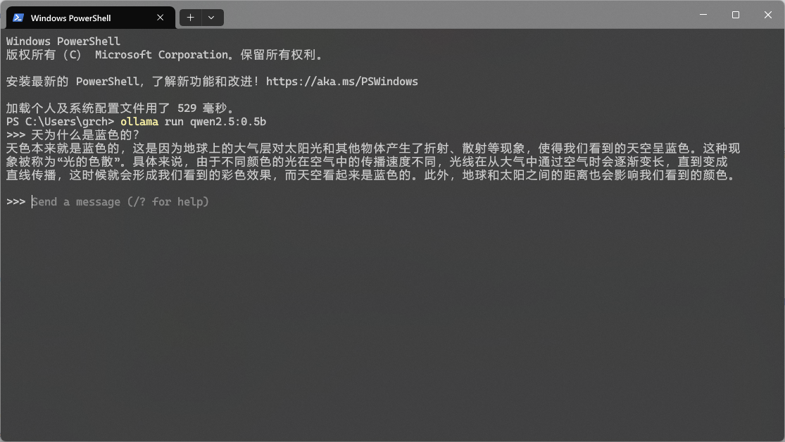
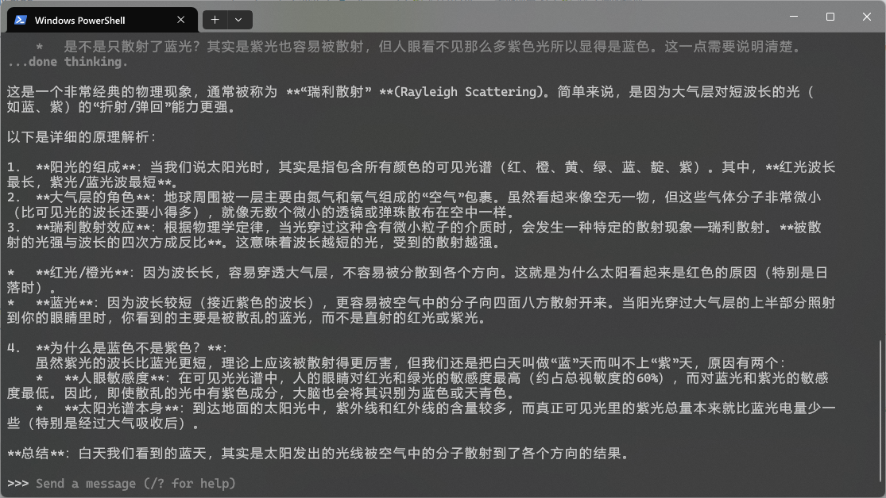

# 使用 Ollama 本地部署 AI

在自己的电脑上拥有一个可以对话的 AI 助手，这在几年前还是科幻小说中的桥段。然而，到了 2026 年的今天，它已然成为了现实。并且，无需价格高昂的独立显卡，轻薄本用户也可尝试！

## 需要什么？

- 一台电脑（普通轻薄本即可）
- 5GB 可用空间
- 国际互联网连接

没错，这就足够了。

以下是本次所用测试机的配置：

- CPU：i5-1135G7
- 内存：16GB
- 显卡：集成

## 安装 Ollama

Ollama 的安装方法堪称“傻瓜式”：Windows 用户只需在 PowerShell 中粘贴如下命令：

```powershell
irm https://ollama.com/install.ps1 | iex
```

如果要指定安装位置：

```powershell
$env:OLLAMA_INSTALL_DIR="D:\Ollama"; irm https://ollama.com/install.ps1 | iex
```

之后只需要等进度条爬到 100% 就可以了。

## 开始对话

开始对话前，需要先下载模型。在 Windows 上，模型默认保存在 `C:\Users\%username%\.ollama\models`。由于模型通常至少有几百 MB 大小，大部分都在 2GB 以上，建议最好不要保存到 C 盘。

要将模型保存到不同的位置，需要设置 `OLLAMA_MODELS` 环境变量。打开设置 > 系统 > 关于 > 高级系统设置 > 环境变量，在用户变量下点击“新建”，变量名输入 `OLLAMA_MODELS`，变量值输入保存模型的位置，然后全部确定。

在终端中输入下面的命令：

```bash
ollama run qwen2.5:0.5b
```

随后，Ollama 会自动下载模型，下载好后就会显示对话界面了：



要退出，输入 `/bye` 即可。

## 不同的模型

刚才我们下载了 `qwen2.5:0.5b` 这个模型。它的参数量只有 0.5B，因此在任何电脑上都可以流畅运行，大小也只有 398MB，很适合拿来试试水。然而，对于任何稍有难度的问题，它就明显不够用了。

为此，我们有必要下载参数量更大的模型。参数量更大的模型回答更准确，但速度更慢，占用空间也更多。不过需要注意，参数量并非唯一标准，有时参数量较小的模型也能有比参数量更大的模型更好的效果，一般而言，推理（reasoning/thinking）模型比普通模型输出质量更高，代价则是生成正式的回答前需要一段时间“思考”。

这里我推荐 `kwangsuklee/Qwen3.5-4B-Claude-4.6-Opus-Reasoning-Distilled-GGUF:latest` 这个模型。它基于 `qwen3.5:4b`，是一个 4B 参数的推理模型。它蒸馏了 Claude Opus 4.6，因此输出质量比普通 `qwen3.5:4b` 高不少。

使用下面的命令下载并运行它：

```bash
ollama run kwangsuklee/Qwen3.5-4B-Claude-4.6-Opus-Reasoning-Distilled-GGUF
```

如果你只想下载，不想马上运行，使用 `pull` 命令：

```bash
ollama pull kwangsuklee/Qwen3.5-4B-Claude-4.6-Opus-Reasoning-Distilled-GGUF
```

可以看到，对于同样的问题，该模型的回答明显比 `qwen2.5:0.5b` 的回答好：



## 实用程度怎样？

这里我让两个模型分别总结我的博客文章：[x86-64 调用约定及 ABI 总结](../2025/x86-64-abi.html)。

以下是 0.5B 模型的输出（截取部分）：

> **1. `__fastcall` 指令**
>
> `__fastcall` 是 x86-64 Windows 下调用约定的唯一方式。它的 32 位版本和 64 位版本略有不同。
>
> - **参数传递**：
>   - 32 位版本通过寄存器传递，包括整数、浮点数。
>   - 64 位版本也使用寄存器传递，并且前四个参数中的整数分别通过 `rcx`、`rdx`、`r8`、`r9` 传递，前四个为易失性寄存器。
>   - 剩余的两个参数（浮点数）则通过栈传递。
> - **返回值**：
>   - `rax` 传递整数和 `xmm0`、`xmm1`、`xmm2`、`xmm3` 传递浮点数。
>
> **2. 易失性与非易失性寄存器**
>
> - 非易失性寄存器：除了 `rsp`，没有定义为易失性。
> - 易失性寄存器：包括 `rcx`、`rdx`、`r8`、`r9` 等，需要在调用前自行保存。
> - 为函数的局部变量分配栈空间，并在使用后恢复原值。
>
> **3. Prolog 和 Epilog**
>
> Prolog（程序头）：定义函数的行为；
> Epilog（程序尾部）：清理临时栈空间和其他未使用的内存。例如，可能包括`rsp`、`rsi`等寄存器的回收。
>
> **4. Shadow Space**
>
> Shadow space是为某个函数保留的一块内存区域，其中存放了被调用函数的部分参数。在 x86-64 架构中，栈从高地址向低地址“增长”，因此当栈内容增多时，`rsp` 的值会减小。
>
> **5. `printf` 实现**
>
> C 语言中的 `printf` 是通过局部变量 `n` 和 `f(int)` 来实现的。函数 `a` 还调用了另一个函数 `f()`, 而且 `f()` 需要从其全局变量 `n` 的值中返回。

不出所料，幻觉非常严重，简直就是一派胡言。

以下是 4B 模型的输出（截取部分）：

> 🔑 **关键知识要点**
>
> 1. **参数传递机制（__fastcall）**
>
> | 类型 | 寄存器/方式 |
> |------|------------|
> | 前4个整数参数 | `rcx`, `rdx`, `r8`, `r9` |
> | 前4个浮点参数 | `xmm0`, `xmm1`, `xmm2`, `xmm3` |
> | 剩余参数 | **栈传递**（从右到左）|
>
> 2. **返回值传递**
> ```c
> // int (32位) → eax/rax
> // double/float(64位) → xmm0
> ```
>
> 3. **寄存器分类**
>
> 🟢 非易失性（被调用者必须保存）
> `rbx, rbp, rdi, rsi, rsp, r12-r15, xmm6-xmm15`
>
> 🔴 易失性（可被修改，需自行保存前值）  
> `rcx, rdx, r8-r11, xmm0-xmm5`
>
> 4. **Prolog/Epilog 职责**
>
> | Prolog | Epilog |
> |--------|--------|
> | 保存寄存器参数到 shadow space | 清理局部变量和shadow space |
> | 分配栈空间 | 恢复非易失性寄存器 |
> | 为调用函数预留shadow space | return to caller |
>
> 5. **Shadow Space（阴影区）**
> ```text
> 大小: 4(参数数) × 8(byte/参数) = 32字节 (固定值)
> 用途: 
> ├── 保存参数便于调试（release/优化关闭时不生成）
> └── 简化变参函数实现
> ```
>
> 6. **栈对齐与空间分配示例**
> ```asm
> f():              ; void f(void); int n=50; a(n)
>     sub rsp, 40   ; = 8(返回地址)+4(var)+32(shadow)+4(alignment)
>     
> stack frame:      ;rsp后为最低
> ┌───────────────────┐
> │ shadow space(32B) │  
> │ alignment padding │  ← 未使用，用于16字节对齐
> └───────────────────┘   rsp = RSP+40前
> 
> 返回地址 (8B)    ─────> call指令压入栈破坏了对齐
> ```
>
> 📊 **关键数值总结表**
>
> | 项目 | 值/名称 |
> |------|---------|
> | Shadow space 固定大小 | **32 字节** |
> | 局部变量分配指令 | `sub rsp, N` (N = 所需字节) |
> | 栈清理指令 | `add rsp, N` (恢复原状态) |
> | 栈对齐要求 | **16 字节边界** |
> | x86-64 RSP增长方向 | → **(降低)** 栈顶向下增长 |

虽然仍有一些幻觉，但比 0.5B 模型好太多了，已经达到可以接受的水平。但速度也慢得多，推理花了一分钟，生成完整的输出又花了几分钟。

另外，用过 Claude 的朋友们肯定都知道，Claude 很喜欢用制表符画一些图表。这家伙把这一点也学去了，但由于参数量太小，画出来全都是乱的……

---

需要说明的是，我的问题本来就比较“硬核”，因此无法代表模型在其他使用场景下的表现。还是建议大家自己试一试。

> [!TIP]
> 额外提示：提出的问题越明确，回答质量也越高。用英文提问得到的回答质量明显比用中文时高（两个模型都是如此）。通过这两点，可以有效提升模型的回答质量。

## 结论

- 0.5B 模型：很流畅，但过于智障，几乎没有实用价值（对我而言）
- 4B 模型：不错，但速度慢得多

总而言之，得益于开源社区的贡献，本地部署大语言模型对于轻薄本用户来说已经达到了“能用”的程度。如果你不介意等几分钟才出结果的话，真的可以认真考虑了。毕竟，无需网络、无需额外付费、隐私绝对安全，这都是无可比拟的优势。
