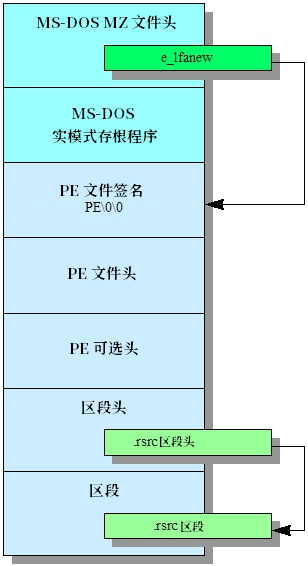

# 手写一个 64 位 PE32+ 可执行文件

PE（Portable Executable）是一种可执行文件格式，最早于 Windows NT 3.1 引入，用于取代 16 位的 MZ、NE 等格式。PE 有两种版本：32 位的 PE32 和 64 位的 PE32+，后者有时也被称为 PE64，但 PE32+ 才是标准的名称。两者的差别很小。

PE 是 Windows 上应用程序、动态链接库、驱动程序等的标准格式，现在也被用作 UEFI 应用程序的文件格式。

PE 文件的结构如下图所示：



> _原图来自 OSDev Wiki，由本文作者翻译。_

本文将从前往后介绍 PE 文件的各个部分。

## DOS 存根（DOS Stub）

如果你尝试过使用记事本之类的文本编辑器打开一个 PE 文件，不难发现其中会有一句话：

```
This program cannot be run in DOS mode.
```

这是因为，出于兼容性考虑，微软在 PE 文件的最前面加上了一段 DOS 存根（DOS Stub）。它本质上是一个可在 DOS 上运行的实模式程序，这样，当用户尝试在 DOS 上运行 PE 文件时，就会打印上面那句话。Windows 不会执行 DOS 存根的内容。

所有 PE 文件都必须以 `4D 5A`（即字符串 `"MZ"`）开头，它是 DOS 可执行文件的签名，PE 也继承了下来。

所以，我们的代码可以这样写：

```asm
bits 64 ; 指示汇编器生成 64 位代码

db "MZ" ; MZ 签名
times 58 db 0 ; DOS 文件头的其他部分，Windows 不关心，可以填 0
```

在文件的偏移量 60（0x3C）处，是 DOS 头中的 `e_lfanew` 字段，它是一个 32 位的偏移量，指向真正的 PE 文件头的开始。

```asm
dd PE_HEADER ; e_lfanew

PE_HEADER:
```

## PE 头（PE Header）

在 DOS 存根之后，紧接着的就是 PE 头。PE 头以 `50 45 00 00`（即字符串 `"PE\0\0"`）开始，它是 PE 文件的签名。

```asm
db "PE", 0, 0 ; PE 签名
```

PE 很大程度上是 COFF（Common Object File Format）的一种扩展，PE 文件头也与 COFF 文件头基本相同。因此，PE 头有时也被叫做 COFF 头。

PE 头除了签名以外的字段如下（以 C 语言结构体的形式展示，不考虑对齐）：

```c
struct PEHeader {
  short Machine;
  short NumberOfSections;
  long TimeDateStamp;
  long PointerToSymbolTable;
  long NumberOfSymbols;
  short SizeOfOptionalHeader;
  short Characteristics;
};
```

> `short` 为 16 位，`long` 为 32 位，`long long` 为 64 位。

- **`Machine`**：此文件的目标 CPU 架构。0x14C 表示 i386，0x8664 表示 x86-64，0xAA64 表示 ARM64。
- **`NumberOfSections`**：文件中区段的数量
- **`TimeDateStamp`**：POSIX 时间戳，表示文件构建的时间
- **`PointerToSymbolTable`**：符号表的偏移量
- **`NumberOfSymbols`**：符号表中符号的数量
- **`SizeOfOptionalHeader`**：可选头的大小，PE32 的标准大小为 0xE0（224），PE32+ 的标准大小为 0xF0（240）
- **`Characteristics`**：文件的特征，可以是以下值按位或的结果：
  - **`IMAGE_FILE_EXECUTABLE_IMAGE`（0x0002）**：文件是可执行文件
  - **`IMAGE_FILE_LARGE_ADDRESS_AWARE`（0x0020）**：文件可以处理超过 2GB 的内存地址
  - **`IMAGE_FILE_DLL`（0x2000）**：文件是动态链接库（DLL）

本文并未列出 `Machine` 和 `Characteristics` 的所有可选值，只列出了最常见的几个。如有需要，请查阅下文“参考”一节列出的文档。

代码如下：

```asm
dw 0x8664 ; Machine
dw 1 ; NumberOfSections
dd 0 ; TimeDateStamp
dd 0 ; PointerToSymbolTable
dd 0 ; NumberOfSymbols
dw 0xF0 ; SizeOfOptionalHeader
dw 0x22 ; Characteristics
        ; IMAGE_FILE_EXECUTABLE_IMAGE | IMAGE_FILE_LARGE_ADDRESS_AWARE
```

## 可选头（Optional Header）

尽管叫这个名字，但可选头实际上是强制性的。PE 头和可选头可以合称为 NT 头。PE32+ 可选头的结构如下：

```c
struct PEOptionalHeader {
  short signature;
  char MajorLinkerVersion; 
  char MinorLinkerVersion;
  long SizeOfCode;
  long SizeOfInitializedData;
  long SizeOfUninitializedData;
  long AddressOfEntryPoint;
  long BaseOfCode;
  long long ImageBase;
  long SectionAlignment;
  long FileAlignment;
  short MajorOSVersion;
  short MinorOSVersion;
  short MajorImageVersion;
  short MinorImageVersion;
  short MajorSubsystemVersion;
  short MinorSubsystemVersion;
  long Win32VersionValue;
  long SizeOfImage;
  long SizeOfHeaders;
  long Checksum;
  short Subsystem;
  short DLLCharacteristics;
  long long SizeOfStackReserve;
  long long SizeOfStackCommit;
  long long SizeOfHeapReserve;
  long long SizeOfHeapCommit;
  long LoaderFlags;
  long NumberOfRvaAndSizes;
  struct data_directory DataDirectory[NumberOfRvaAndSizes];
};
```

PE32 的可选头略有不同，此处不表，请查阅文档。

- **`signature`**：可选头的签名，PE32 为 0x10B，PE32+ 为 0x20B
- **`MajorLinkerVersion`**：链接器的主版本号
- **`MinorLinkerVersion`**：链接器的次版本号
- **`SizeOfCode`**：代码段（`.text`）的大小，若有多个代码段，则为所有代码段的总和
- **`SizeOfInitializedData`**：已初始化的数据段（`.data`）的大小，若有多个段，则为所有段的总和
- **`SizeOfUninitializedData`**：未初始化的数据段（`.bss`）的大小，若有多个段，则为所有段的总和
- **`AddressOfEntryPoint`**：入口点的相对虚拟地址（Relative Virtual Address, RVA）
- **`BaseOfCode`**：代码段的起始 RVA
- **`ImageBase`**：映像加载的基址，需为 0x10000 的整数倍
- **`SectionAlignment`**：区段的对齐大小，需大于或等于 `FileAlignment`。标准值为一个内存页的大小（通常为 0x1000，即 4096）
- **`FileAlignment`**：文件的对齐大小，需为 2 的幂，且在 [512, 65536] 范围内。标准值为 0x200（512）
- **`MajorOSVersion`**：要求的最低操作系统的主版本号
- **`MinorOSVersion`**：要求的最低操作系统的次版本号
- **`MajorImageVersion`**：映像的主版本号
- **`MinorImageVersion`**：映像的次版本号
- **`MajorSubsystemVersion`**：子系统的主版本号
- **`MinorSubsystemVersion`**：子系统的次版本号
- **`Win32VersionValue`**：保留，必须为 0
- **`SizeOfImage`**：映像的大小，注意，是**加载到内存中的大小，不是在磁盘上的大小**。需为 `SectionAlignment` 的整数倍
- **`SizeOfHeaders`**：所有头部的大小，包含 DOS 存根、PE 头、可选头和所有区段头。需为 `FileAlignment` 的整数倍
- **`Checksum`**：校验和，一般无需在意
- **`Subsystem`**：子系统类型，2 为 Windows GUI 子系统，3 为控制台子系统
- **`DLLCharacteristics`**：DLL 的特征，我们现在可以不管
- **`SizeOfStackReserve`**：保留的栈空间的大小
- **`SizeOfStackCommit`**：提交的栈空间的大小
- **`SizeOfHeapReserve`**：保留的堆空间的大小
- **`SizeOfHeapCommit`**：提交的堆空间的大小
- **`LoaderFlags`**：加载器的标志，已废弃
- **`NumberOfRvaAndSizes`**：数据目录的数量，我们现在可以直接填 0
- **`DataDirectory`**：数据目录表，由 `NumberOfRvaAndSizes` 个 `data_directory` 组成，我们现在用不上

数据目录表中的每个条目都指向特定的数据，包括导入表、导出表、资源表等。最多有 16 个条目。未使用的条目可以填 0。每个条目都是一个 `data_directory` 结构体：

```c
struct data_directory {
  long VirtualAddress; // 数据的 RVA
  long Size;           // 数据的大小
};
```

代码如下：

```asm
IMAGE_BASE equ 0x140000000 ; x64 Windows 上常见的映像基址
ENTRY_RVA equ 0x1000 ; 入口点的相对虚拟地址
; 其他常量会在下文定义

OPTIONAL_HEADER:

dw 0x20B ; signature
db 0 ; MajorLinkerVersion
db 0 ; MinorLinkerVersion
dd CODE_SIZE ; SizeOfCode
dd 0 ; SizeOfInitializedData
dd 0 ; SizeOfUninitializedData
dd ENTRY_RVA ; AddressOfEntryPoint
dd ENTRY_RVA ; BaseOfCode
dq IMAGE_BASE ; ImageBase
dd 0x1000 ; SectionAlignment
dd 0x200 ; FileAlignment
; 要求的最低操作系统，这里设为 6.0，即 Windows Vista
dw 6 ; MajorOSVersion
dw 0 ; MinorOSVersion
dw 0 ; MajorImageVersion
dw 0 ; MinorImageVersion
dw 6 ; MajorSubsystemVersion
dw 0 ; MinorSubsystemVersion
dd 0 ; Win32VersionValue
; 入口点 RVA 是 0x1000，加上代码段的大小，向上对齐，得到 0x2000
dd 0x2000 ; SizeOfImage
dd 0x200 ; SizeOfHeaders
dd 0 ; Checksum
dw 3 ; Subsystem
     ; Windows CUI
dw 0 ; DLLCharacteristics
; 我们的程序不需要使用栈和堆
dq 0 ; SizeOfStackReserve
dq 0 ; SizeOfStackCommit
dq 0 ; SizeOfHeapReserve
dq 0 ; SizeOfHeapCommit
dd 0 ; LoaderFlags
dd 0 ; NumberOfRvaAndSizes
; 16 个空数据目录
times 16 dq 0 ; DataDirectory
```

## 地址概念的解析

**虚拟地址（缩写为 VA，也称逻辑地址）**，顾名思义，就是假的地址，与真实的物理地址相对。我们平时看到的地址（包括在 C 语言中用 `&` 运算符取地址得到的）都是虚拟地址。虚拟地址会由操作系统经过各种转换得到物理地址。每个进程都有独立的虚拟地址空间，也就是说，同一个虚拟地址，对于不同的进程，会对应不同的物理地址。

**映像基址（`ImageBase`）**，是一个可执行文件（映像）加载到内存时的起始地址，它是虚拟地址。

**相对虚拟地址（RVA）**，是相对于映像基址的偏移量。可以通过以下公式计算：

```
RVA = VA - ImageBase
```

至于**文件偏移地址（File Offset Address，也称文件指针）**，是数据在磁盘上的文件中的偏移量。换句话说，它表示数据是文件中的第几个字节。

## 区段头（Section Headers）

区段头说明了一个区段的信息，包括区段名、区段的 FOA，以及应将它加载到哪个 RVA。如果有多个区段，则会有连续的多个区段头。区段头的结构如下所示：

```c
struct IMAGE_SECTION_HEADER {
  char  Name[8];
  long  VirtualSize;
  long  VirtualAddress;
  long  SizeOfRawData;
  long  PointerToRawData;
  long  PointerToRelocations;
  long  PointerToLinenumbers;
  short NumberOfRelocations;
  short NumberOfLinenumbers;
  long  Characteristics;
};
```

- **`Name`**：该段的名称，是以 `\0` 结尾的字符串。可以随便起，但习惯上是 `.text`、`.data` 等
- **`VirtualSize`**：该段在内存中的大小
- **`VirtualAddress`**：该段在内存中的起始 RVA，即该区段应被加载到的位置，需为 `SectionAlignment` 的整数倍
- **`SizeOfRawData`**：该段在磁盘上的大小，需为 `FileAlignment` 的整数倍
- **`PointerToRawData`**：该段的 FOA，需为 `FileAlignment` 的整数倍
- **`PointerToRelocations`**：该段的重定位表的 FOA，没有重定位表时为 0
- **`PointerToLinenumbers`**：该段的行号表的 FOA，没有行号表时为 0
- **`NumberOfRelocations`**：重定位表的条目数
- **`NumberOfLinenumbers`**：行号表的条目数
- **`Characteristics`**：该段的属性，可以是以下值按位或的结果：
  - **`IMAGE_SCN_CNT_CODE`（0x20）**：该段是代码段
  - **`IMAGE_SCN_CNT_INITIALIZED_DATA`（0x40）**：该段是已初始化数据
  - **`IMAGE_SCN_CNT_UNINITIALIZED_DATA`（0x80）**：该段是未初始化数据
  - **`IMAGE_SCN_MEM_EXECUTE`（0x20000000）**：该段可执行
  - **`IMAGE_SCN_MEM_READ`（0x40000000）**：该段可读
  - **`IMAGE_SCN_MEM_WRITE`（0x80000000）**：该段可写

代码如下：

```asm
SECTION_HEADER:
db ".text", 0, 0, 0 ; Name
dd CODE_SIZE ; VirtualSize
dd ENTRY_RVA ; VirtualAddress
dd CODE_RAW_SIZE ; SizeOfRawData
dd CODE_START ; PointerToRawData
dd 0 ; PointerToRelocations
dd 0 ; PointerToLinenumbers
dw 0 ; NumberOfRelocations
dw 0 ; NumberOfLinenumbers
dd 0x60000020 ; Characteristics
              ; IMAGE_SCN_CNT_CODE | IMAGE_SCN_MEM_EXECUTE | IMAGE_SCN_MEM_READ
```

## 区段（Sections）

区段就是代码和数据真正存储的地方。每个区段都必须按 `FileAlignment` 对齐。DOS 存根 64 字节，PE 签名 4 字节，PE 头 20 字节，可选头 240 字节，一个区段头 40 字节，目前还只有 368 字节，所以还需要填充到 512 字节。代码如下：

```asm
; 填充 0 到 512 字节
times 512 - ($ - $$) db 0

CODE_START:
  ; 死循环，这样可以最直观地看到程序是否正常运行
  jmp short CODE_START
CODE_END:

CODE_SIZE equ CODE_END - CODE_START

; 填充 512 - CODE_SIZE 个 0，满足对齐要求
times 512 - CODE_SIZE db 0

CODE_RAW_SIZE equ $ - CODE_START
```

## 总结

本文介绍了 PE 文件的基本结构，分别为：

- MZ 签名，所有 PE 文件都必须以它开头
- DOS 存根，出于兼容性而设计，Windows 忽略它
- PE 签名，`"PE\0\0"`
- PE 头，也称 COFF 头，包含 PE 文件的基本信息
- 可选头，实际上并不可选，包含 PE 文件的重要信息
- 区段头，包含区段的信息
- 区段，包含区段的代码和数据

要运行本文中的代码，将它们全都保存到一个文件中，然后用 `nasm` 汇编：

```bash
nasm -f bin -o pe.exe pe.asm
```

打开 `pe.exe`，会看到一个控制台窗口，表明程序正常运行。

由于 `FileAlignment` 最小为 512，一个标准的 PE 文件的大小至少为 1KiB。在网上能看到一些只有数百字节的极小 PE 文件，它们使用了一些非标准的 hack，例如将 `FileAlignment` 设置为小于 512，以及将一些结构重叠。这样的文件严格来说是非法的，只是 Windows 加载器比较宽容，仍然允许运行。

下篇文章将探讨动态链接的基本原理——如何手写导入表（挖坑）。

## 参考

[PE Format - Win32 apps | Microsoft Learn](https://learn.microsoft.com/en-us/windows/win32/debug/pe-format)

[x86 Disassembly/Windows Executable Files](https://en.wikibooks.org/wiki/X86_Disassembly/Windows_Executable_Files)

[PE - OSDev Wiki](https://wiki.osdev.org/PE)

[IMAGE_FILE_HEADER structure (winnt.h) - Win32 apps | Microsoft Learn](https://learn.microsoft.com/en-us/windows/win32/api/winnt/ns-winnt-image_file_header)

[2.2 PE结构：文件头详细解析 | LyShark®](https://www.lyshark.com/post/8655d86a.html)
